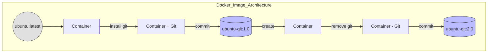

# 🐳 Docker Image Layer Management & Size Optimization

[](https://github.com/TheToriqul/docker-image-size-management)
[](https://github.com/TheToriqul/docker-image-size-management/stargazers)


## 📋 Project Overview

This project demonstrates advanced Docker image management techniques, focusing on layer manipulation and size optimization. Through practical implementation, I explored Docker's Union File System (UFS), image layering mechanics, and strategies for efficient container image management. The project showcases real-world approaches to understanding and controlling Docker image sizes while maintaining functionality.

## 🎯 Key Objectives

- Master Docker image layer architecture and their impact on overall image size
- Implement practical techniques for Docker image size optimization
- Understand the implications of Union File System on image modifications
- Develop expertise in Docker commit operations and layer management
- Gain hands-on experience with container modification and image versioning

## 🏗️ Project Architecture



## 💻 Technical Stack

- Frontend: Not applicable
- Backend: Docker Engine, Shell Scripts
- Database: Not applicable
- DevOps: Docker, Git, Ubuntu

## 🚀 Getting Started

<details>
<summary>🐳 Prerequisites</summary>

- Docker Engine installed (version 20.10 or higher)
- Basic understanding of Docker concepts
- Shell access with sudo privileges
- Minimum 2GB free disk space

</details>

<details>
<summary>⚙️ Installation</summary>

1. Clone the repository:
   ```bash
   git clone https://github.com/TheToriqul/docker-image-size-management.git
   ```
2. Navigate to the project directory:
   ```bash
   cd docker-image-size-management
   ```

</details>

<details>
<summary>🎮 Usage</summary>

1. Pull the base Ubuntu image:
   ```bash
   docker pull ubuntu
   ```
2. Create a container and install Git:
   ```bash
   docker run -d --name ubuntu-git-container ubuntu sleep infinity
   ```
3. Modify and commit changes:
   ```bash
   docker commit ubuntu-git-container ubuntu-git:1.0
   ```

For detailed commands and explanations, refer to the [reference-commands.md](reference-commands.md) file.

</details>

## 💡 Key Learnings

### Technical Mastery:

1. Deep understanding of Docker's Union File System (UFS)
2. Advanced container modification techniques
3. Image layer manipulation and management
4. Docker commit workflow optimization
5. Size impact analysis of container modifications

### Professional Development:

1. Systematic approach to Docker image optimization
2. Best practices for container image management
3. Efficient debugging of layer-related issues
4. Documentation of technical processes
5. Version control integration with Docker workflows

### 🔄 Future Enhancements

<details>
<summary>View Planned Improvements</summary>

1. Implement multi-stage builds for further size optimization
2. Add automated layer analysis tools
3. Create size comparison benchmarking
4. Develop cleanup automation scripts
5. Integrate CI/CD pipeline for image optimization
6. Add support for additional base images
</details>

## 🙌 Contribution

Contributions are welcome! Feel free to [open an issue](https://github.com/TheToriqul/docker-image-size-management/issues) or submit a [pull request](https://github.com/TheToriqul/docker-image-size-management/pulls) to suggest improvements or add features.

## 📧 Connect with Me

- 📧 Email: toriqul.int@gmail.com
- 📱 Phone: +65 8936 7705, +8801765 939006
- 🌐 LinkedIn: [@TheToriqul](https://www.linkedin.com/in/thetoriqul/)
- 🐙 GitHub: [@TheToriqul](https://github.com/TheToriqul)
- 🌍 Portfolio: [TheToriqul.com](https://thetoriqul.com)

Let's connect and discuss all things Docker and beyond!

## 👏 Acknowledgments

- [Poridhi for providing comprehensive labs and inspiring this project](https://devops.poridhi.io/)
- The Docker community for excellent documentation and resources
- Fellow developers who provided valuable feedback and suggestions
- Open source contributors who help improve Docker tooling
- Technical mentors who guided my learning journey

---

Thank you for visiting this repository and joining me on this exciting learning journey. I hope you find the project insightful and valuable. Happy containerizing! 🚀